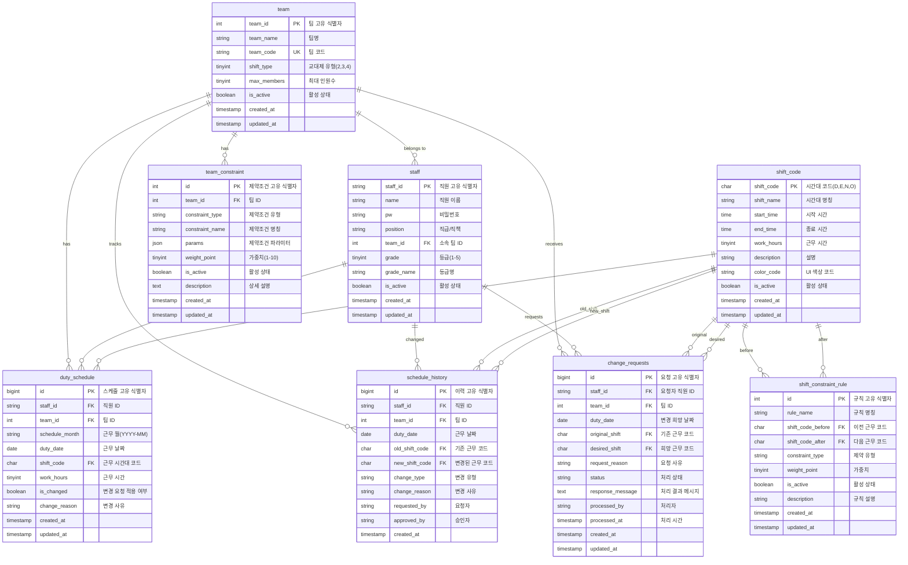

# 🎨 Entity Relationship Diagram (ERD)

## 📊 개선된 근무표 시스템 ERD



## 🔗 관계 설명

### 1:N 관계 (One-to-Many)
- **team → staff**: 한 팀에 여러 직원 소속
- **team → duty_schedule**: 한 팀의 여러 근무 스케줄
- **team → team_constraint**: 한 팀의 여러 제약조건
- **staff → duty_schedule**: 한 직원의 여러 근무 일정
- **staff → change_requests**: 한 직원의 여러 변경 요청
- **shift_code → duty_schedule**: 한 시간대 코드의 여러 근무 배정

### 자기 참조 관계
- **shift_constraint_rule**: 시간대 간 연결 규칙 (N→E 금지 등)

### 복합 관계
- **duty_schedule**: staff, team, shift_code 3개 테이블과 연결
- **change_requests**: 요청자, 팀, 기존/희망 시간대 연결

---

## 📈 ERD 기반 성능 최적화 포인트

### 🎯 핵심 조회 패턴
```sql
-- 패턴 1: 팀별 월 스케줄 조회
SELECT * FROM duty_schedule 
WHERE team_id = ? AND schedule_month = ?;

-- 패턴 2: 개인별 월 스케줄 조회  
SELECT * FROM duty_schedule 
WHERE staff_id = ? AND schedule_month = ?;

-- 패턴 3: 특정 날짜 팀 현황
SELECT * FROM duty_schedule 
WHERE team_id = ? AND duty_date = ?;
```

### 🚀 인덱스 전략 (ERD 기반)
```sql
-- duty_schedule 핵심 인덱스
CREATE INDEX idx_team_month ON duty_schedule(team_id, schedule_month);
CREATE INDEX idx_staff_month ON duty_schedule(staff_id, schedule_month);  
CREATE UNIQUE INDEX uk_staff_date ON duty_schedule(staff_id, duty_date);

-- 관계 기반 조인 최적화
CREATE INDEX idx_staff_team ON staff(team_id, is_active);
CREATE INDEX idx_constraint_team ON team_constraint(team_id, is_active);
```

### 🔄 파티셔닝 전략
```sql
-- duty_schedule: 월별 파티셔닝 (ERD 중심 테이블)
PARTITION BY RANGE (YEAR(duty_date) * 100 + MONTH(duty_date));

-- schedule_history: 연도별 파티셔닝  
PARTITION BY RANGE (YEAR(created_at));
```

---

## 🎨 ERD 시각화 특징

### 색상 구분 (논리적 그룹)
- **🔵 Core Tables**: team, staff, duty_schedule  
- **🟡 Configuration**: shift_code, team_constraint, shift_constraint_rule
- **🟠 History/Audit**: schedule_history, change_requests

### 관계선 두께
- **굵은 선**: 핵심 비즈니스 관계 (team-staff, staff-duty_schedule)
- **중간 선**: 설정/참조 관계 (shift_code 참조)  
- **얇은 선**: 이력/감사 관계 (history, requests)

### FK 네이밍 컨벤션
- **{table}_{column}**: 명확한 참조 관계 표시
- **composite FK**: 복합 외래키로 데이터 정합성 보장

---

## 🎯 ERD 검증 체크리스트

### ✅ 정규화 검증
- [x] 1NF: 원자값 저장 (JSON 제외)
- [x] 2NF: 부분 함수 종속 제거
- [x] 3NF: 이행적 함수 종속 제거
- [x] BCNF: 결정자가 후보키

### ✅ 무결성 제약
- [x] Entity Integrity: 모든 PK 정의
- [x] Referential Integrity: FK 관계 명시
- [x] Domain Integrity: 적절한 데이터 타입
- [x] User-defined Integrity: 비즈니스 규칙 반영

### ✅ 성능 고려사항  
- [x] 자주 조회되는 경로에 인덱스 계획
- [x] 대용량 테이블 파티셔닝 설계
- [x] N+1 문제 방지를 위한 관계 최적화
- [x] 트랜잭션 범위 최소화 고려